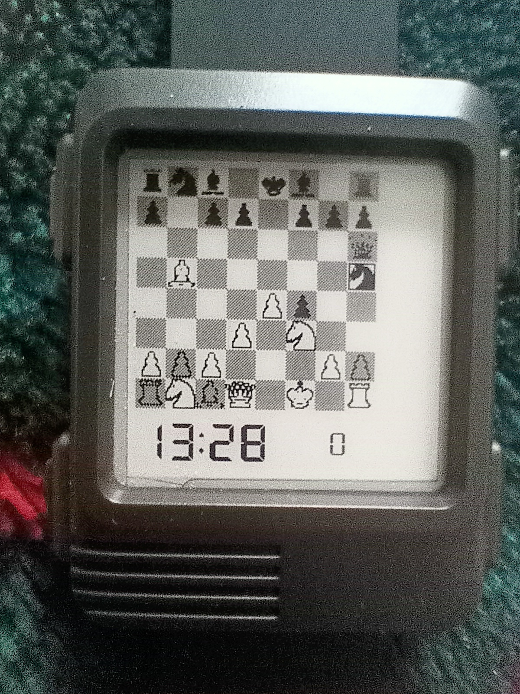
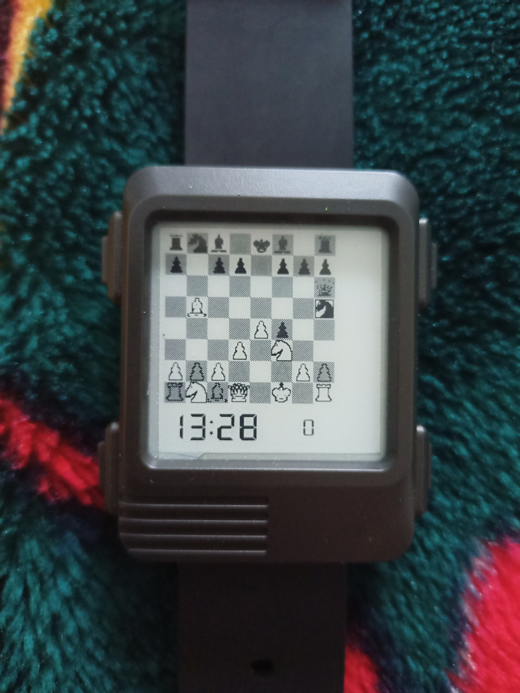

# watchy-chess-face

Chess display for [Watchy](https://watchy.sqfmi.com/).

Currently just displays [this game](https://en.wikipedia.org/wiki/Immortal_Game) on repeat, 1 move a minute

Work in progress™

encode_chess_game.cpp is used to transform a more regular chess notation, to the one used on the Watchy. It was entirely written by ChatGPT :) (I didn't test encode_chess_game.cpp with enpassant, promoting, castling yet, don't expect them to work)

